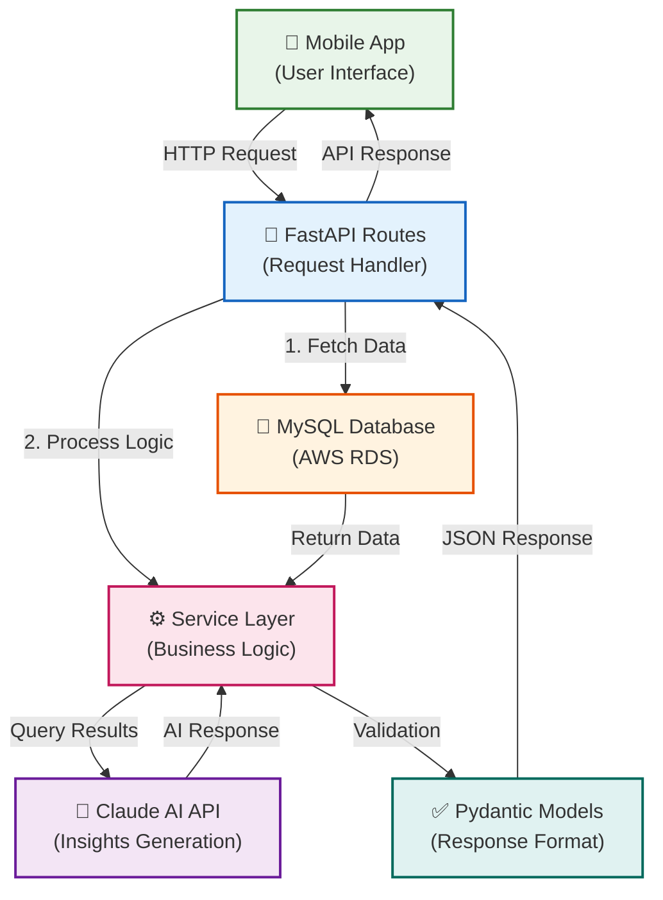
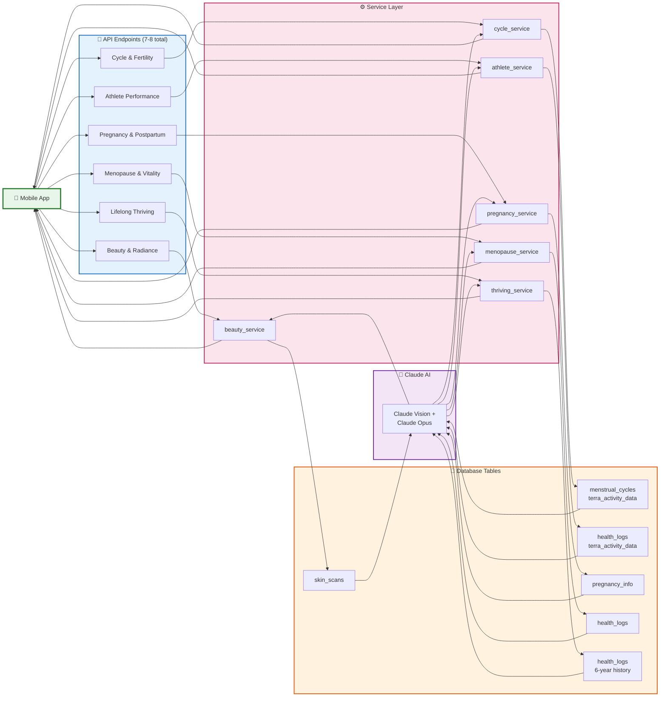

# 📊 Data Workflow Diagram - Pulse_E
## Simple Figma-Ready Data Flow



---

## 📌 **6 Life Journey Endpoints - Data Flow**



---

## 🔄 **Single Endpoint Request-Response Cycle**

```mermaid
sequenceDiagram
    actor User as 📱 User
    participant API as 🔌 FastAPI Route
    participant Service as ⚙️ Service Layer
    participant DB as 💾 MySQL
    participant AI as 🤖 Claude AI
    
    User->>API: HTTP POST /endpoint<br/>with user_id, params
    
    API->>Service: Call service function
    
    Service->>DB: Query data<br/>(30-day history, current state)
    DB-->>Service: Return records (JSON, timestamps)
    
    Service->>AI: Send prompt<br/>(data + context)
    AI-->>Service: Return insights<br/>(text response)
    
    Service->>Service: Parse response<br/>(extract scores 0-100)
    
    Service-->>API: Return PydanticModel<br/>(validated data)
    
    API->>API: Serialize to JSON
    API-->>User: HTTP 200 + JSON<br/>(today, history,<br/>insights, scores)
    
    style User fill:#E8F5E9
    style API fill:#E3F2FD
    style Service fill:#FCE4EC
    style DB fill:#FFF3E0
    style AI fill:#F3E5F5
```

---

## 📊 **Data Table Dependencies**

| Life Journey | Primary Table | Secondary Tables | AI Role |
|---|---|---|---|
| **Beauty & Radiance** | `skin_scans` | `terra_activity_data` (sleep) | Analyze image + correlate sleep |
| **Cycle & Fertility** | `menstrual_cycles` | `bbt_logs`, `opk_logs`, `terra_activity_data` | Generate cycle insights |
| **Athlete Performance** | `terra_activity_data` | `menstrual_cycles` | Training recommendations by cycle |
| **Pregnancy & Postpartum** | `pregnancy_info` | `health_logs`, `terra_activity_data` | Trimester-specific advice |
| **Menopause & Vitality** | `health_logs` | `menstrual_cycles`, `terra_activity_data` | Symptom analysis + insights |
| **Lifelong Thriving** | `health_logs` | 6-year history tables | Preventative health analysis |

---

## 🎯 **Key Design Principles**

```
1. REQUEST FLOW:
   Mobile App → FastAPI Route → Service → DB + Claude → Pydantic Model → JSON Response

2. DATA HANDLING:
   ✅ All queries are parameterized (prevent SQL injection)
   ✅ Timestamps in ISO 8601 format
   ✅ Scores normalized to 0-100 integer range
   ✅ Status fields: ["Low", "Fair", "Good", "High"]

3. RESPONSE STRUCTURE:
   {
     "user_id": "UUID",
     "today": { metrics for today },
     "history": [ { date, metrics } ],
     "correlations": { correlation_name: value },
     "ai_insights": { structured Claude output },
     "status": "success"
   }

4. ERROR HANDLING:
   ✅ HTTPException(400) - invalid request
   ✅ HTTPException(500) - server error
   ✅ Response validation via Pydantic
```

---

## 📝 **To Recreate in Figma:**

1. **Boxes (Rectangles):**
   - Mobile App (green)
   - FastAPI Routes (blue)
   - Service Layer (pink)
   - MySQL Database (orange)
   - Claude AI (purple)
   - Pydantic Models (teal)

2. **Arrows:**
   - User Request → API (green)
   - API → Service (blue)
   - Service → Database (orange)
   - Service → Claude (purple)
   - Claude → Service (purple)
   - Service → Pydantic (teal)
   - Pydantic → API (blue)
   - API → User Response (green)

3. **Colors:**
   - Green: User interactions
   - Blue: API/Routing
   - Pink: Business logic
   - Orange: Database
   - Purple: AI
   - Teal: Validation

---

Generated: 2026-09-22 | For: Team Alignment
